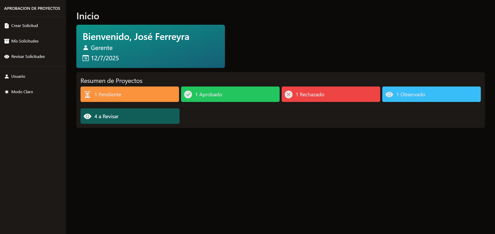
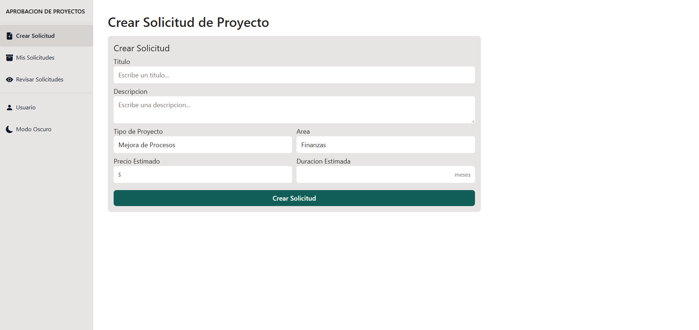
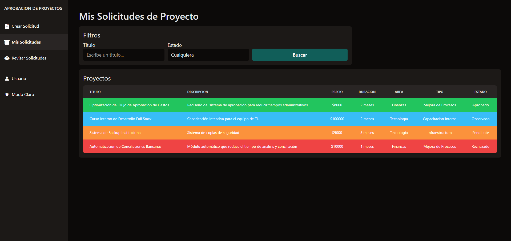
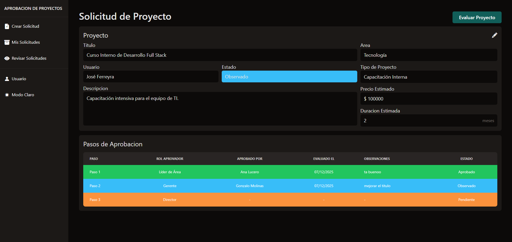
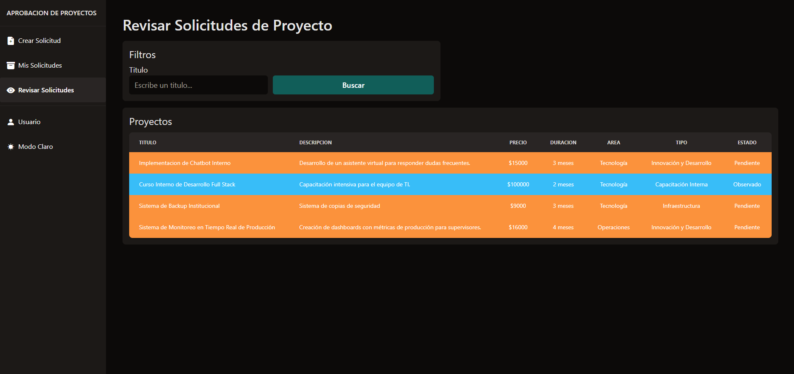
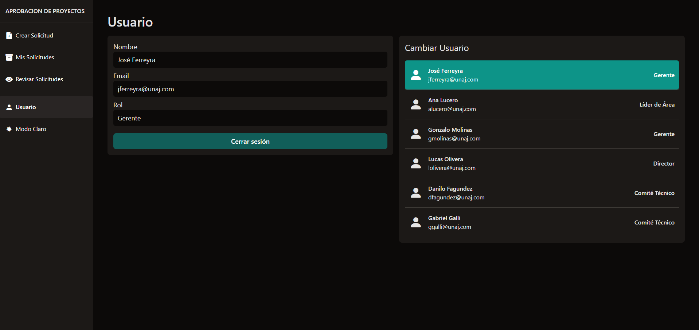

# Aprobación de Proyectos

Sistema completo para gestión y aprobación de proyectos internos dentro de una organización.
Permite registrar propuestas, generar flujos dinámicos de aprobación según reglas configuradas, realizar revisiones, y visualizar el estado completo del ciclo de vida del proyecto.

Desarrollado para la materia Proyecto de Software (UNAJ).
El proyecto incluye Backend (API REST) + Frontend Web + Base de Datos con ORM.

## 📄 Descripcion

Se desarrollo una interfaz web que permite a los usuarios:

- Visualizar los proyectos existentes  
- Crear nuevos proyectos  
- Evaluar y editar propuestas  
- Realizar búsquedas con filtros personalizados

La aplicacion es **100% responsive** y cuenta con **modo claro/oscuro**, permitiendo un uso comodo en cualquier dispositivo.

## 🛠️ Tecnologías utilizadas
### Frontend
- **HTML**, **CSS** y **JavaScript**
- **Tailwind CSS** para el diseño de la interfaz
- **Bootstrap Icons** para los iconos
### Backend
- **C#**
- **EF Core** (SQL Server)
- **Swagger**

El código sigue estrictamente los principios SOLID y la estructura de Clean Architecture, separando responsabilidades y garantizando mantenibilidad y escalabilidad.

## 📷 Capturas

### Home

### Crear Solicitud de Proyecto (con modo claro activado)

### Mis Solicitudes

### Solicitud de Proyecto

### Revisar Solicitudes (Aprobador)

### Usuario

